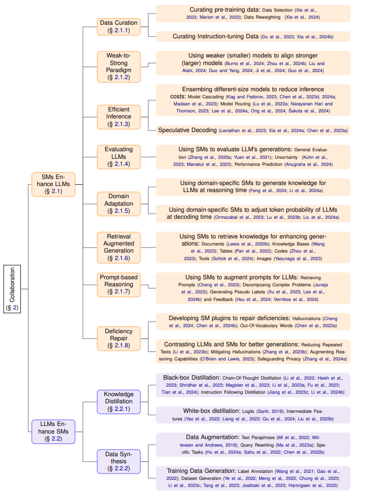

# The Role of Small Models
[](https://arxiv.org/abs/2409.06857)

 

This work is ongoing, and we welcome any comments or suggestions. 

Please feel free to reach out if you find we have overlooked any relevant papers.

<!-- Big font size -->
<h2 align="center">
What is the Role of Small Models in the LLM Era: A Survey
</h2> 

<p align="center">
    Lihu Chen<sup>1</sup>&nbsp&nbsp
    Gaël Varoquaux<sup>2</sup>&nbsp&nbsp
</p>  


<p align="center">
<sup>1</sup> Imperial College London, UK &nbsp&nbsp
<sup>2</sup>  Soda, Inria Saclay, France &nbsp&nbsp
</p>
<div align="center">
  <br>
</div>
<br>


## Content List
- [Collaboration](#collaboration)
  - [SMs Enhance LLMs](#sms-enhance-llms)
    - [Data Curation](#data-curation)
      - [Curating pre-training data](#curating-pre-training-data)
      - [Curating Instruction-tuning Data](#curating-instruction-tuning-data)
    - [Weak-to-Strong Paradigm](#weak-to-strong-paradigm)
    - [Efficient Inference](#efficient-inference)
      - [Ensembling different-size models to reduce inference costs](#ensembling-different-size-models-to-reduce-inference-costs)
      - [Speculative Decoding](#speculative-decoding)
    - [Evaluating LLMs](#evaluating-llms)
    - [Domain Adaptation](#domain-adaptation)
      - [Using domain-specific SMs to generate knowledge for LLMs at reasoning time](#using-domain-specific-sms-to-generate-knowledge-for-llms-at-reasoning-time)
      - [Using domain-specific SMs to adjust token probability of LLMs at decoding time](#using-domain-specific-sms-to-adjust-token-probability-of-llms-at-decoding-time)
    - [Retrieval Augmented Generation](#retrieval-augmented-generation)
    - [Prompt-based Reasoning](#prompt-based-reasoning)
    - [Deficiency Repair](#deficiency-repair)
      - [Developing SM plugins to repair deficiencies](#developing-sm-plugins-to-repair-deficiencies)
      - [Contrasting LLMs and SMs for better generations](#contrasting-llms-and-sms-for-better-generations)
  - [LLMs Enhance SMs](#llms-enhance-sms)
    - [Knowledge Distillation](#knowledge-distillation)
      - [Black-box Distillation](#black-box-distillation)
      - [White-box distillation](#white-box-distillation)
    - [Data Synthesis](#data-synthesis)
      - [Data Augmentation](#data-augmentation)
      - [Training Data Generation](#training-data-generation)
- [Competition](#competition)
  - [Computation-constrained Environment](#)
  - [Task-specific Environment](#)
  - [Interpretability-required Environment](#)

# Collaboration <a name="collaboration"></a>

## SMs Enhance LLMs <a name="sms-enhance-llms"></a>

### Data Curation <a name="data-curation"></a>

#### Curating pre-training data <a name="curating-pre-training-data"></a>
<table>
  <tr>
    <th>Title</th>
    <th>Topic</th>
    <th>Venue</th>
    <th>Code</th>
  </tr>
  <tr>
    <td>Data selection for language models via importance resampling</td>
    <td>Data Selection</td>
    <td><a href="https://arxiv.org/abs/2302.03169"> 
      
      </a></td>
    <td><a href="https://github.com/p-lambda/dsir">
  </a> </td>
  </tr>
  <tr>
    <td>When Less is More: Investigating Data Pruning for Pretraining LLMs at Scale</td>
    <td>Data Selection</td>
    <td><a href="https://arxiv.org/abs/2309.04564"> 
      
      </a></td>
    <td> </td>
  </tr>
  <tr>
    <td>DoReMi: Optimizing Data Mixtures Speeds Up Language Model Pretraining</td>
    <td>Data Reweighting</td>
    <td><a href="https://arxiv.org/abs/2305.10429"> 
      
      </a></td>
    <td><a href="https://github.com/sangmichaelxie/doremi">
   
   </a> </td>
  </tr>
</table>


#### Curating Instruction-tuning Data <a name="curating-instruction-tuning-data"></a>
<table>
  <tr>
    <th>Title</th>
    <th>Topic</th>
    <th>Venue</th>
    <th>Code</th>
  </tr>
  <tr>
    <td>MoDS: Model-oriented Data Selection for Instruction Tuning</td>
    <td>Data Selection</td>
    <td><a href="https://arxiv.org/abs/2311.15653"> 
      
      </a></td>
    <td><a href="https://github.com/CASIA-LM/MoDS">
  </a> </td>
  </tr>
  <tr>
    <td>LESS: Selecting Influential Data for Targeted Instruction Tuning</td>
    <td>Data Selection</td>
    <td><a href="https://arxiv.org/abs/2402.04333"> 
      
      </a></td>
    <td> <a href="https://github.com/princeton-nlp/LESS">
  </a></td>
  </tr>
</table>

### Weak-to-Strong Paradigm <a name="weak-to-strong-paradigm"></a>

#### Using weaker (smaller) models to align stronger (larger) models <a name="using-weaker-smaller-models-to-align-stronger-larger-models"></a>
<table>
  <tr>
    <th>Title</th>
    <th>Topic</th>
    <th>Venue</th>
    <th>Code</th>
  </tr>
  <tr>
    <td>Weak-to-Strong Generalization: Eliciting Strong Capabilities With Weak Supervision</td>
    <td>Weak-to-Strong</td>
    <td><a href="https://arxiv.org/abs/2312.09390"> 
      
      </a></td>
    <td><a href="https://github.com/openai/weak-to-strong">
  </a> </td>
  </tr>
<tr>
    <td>Weak-to-Strong Search: Align Large Language Models via Searching over Small Language Models</td>
    <td>Weak-to-Strong</td>
    <td><a href="https://arxiv.org/abs/2405.19262"> 
      
      </a></td>
    <td><a href="https://github.com/ZHZisZZ/weak-to-strong-search">
  </a> </td>
  </tr>
<tr>
    <td>Co-Supervised Learning: Improving Weak-to-Strong Generalization with Hierarchical Mixture of Experts</td>
    <td>Weak-to-Strong</td>
    <td><a href="https://arxiv.org/abs/2402.15505"> 
      
      </a></td>
    <td><a href="https://github.com/yuejiangliu/csl">
  </a> </td>
</tr>
<tr>
    <td>Improving Weak-to-Strong Generalization with Reliability-Aware Alignment</td>
    <td>Weak-to-Strong</td>
    <td><a href="https://arxiv.org/abs/2406.19032"> 
      
      </a></td>
    <td><a href="https://github.com/Irenehere/ReliableAlignment">
  </a> </td>
</tr>
<tr>
    <td>Aligner: Efficient Alignment by Learning to Correct</td>
    <td>Weak-to-Strong</td>
    <td><a href="https://arxiv.org/abs/2402.02416"> 
      
      </a></td>
    <td><a href="https://github.com/Aligner2024/aligner">
  </a> </td>
</tr>
<tr>
    <td>Vision Superalignment: Weak-to-Strong Generalization for Vision Foundation Models
</td>
    <td>Weak-to-Strong</td>
    <td><a href="https://arxiv.org/abs/2402.03749"> 
      
      </a></td>
    <td><a href="https://github.com/ggjy/vision_weak_to_strong">
  </a> </td>
</tr>
</table>


### Efficient Inference <a name="efficient-inference"></a>

#### Ensembling different-size models to reduce inference costs <a name="ensembling-different-size-models-to-reduce-inference-costs"></a>
<table>
  <tr>
    <th>Title</th>
    <th>Topic</th>
    <th>Venue</th>
    <th>Code</th>
  </tr>
  <tr>
    <td>Efficient Edge Inference by Selective Query</td>
    <td>Model Cascading</td>
    <td><a href="https://openreview.net/forum?id=jpR98ZdIm2q"> 
      
      </a></td>
    <td><a href="https://github.com/anilkagak2/Hybrid_Models">
  </a> </td>
  </tr>
  <tr>
    <td>FrugalGPT: How to Use Large Language Models While Reducing Cost and Improving Performance</td>
    <td>Model Cascading</td>
    <td><a href="https://arxiv.org/abs/2305.05176"> 
      
      </a></td>
    <td> </td>
  </tr>
  <tr>
    <td>Data Shunt: Collaboration of Small and Large Models for Lower Costs and Better Performance</td>
    <td>Model Cascading</td>
    <td><a href="https://ojs.aaai.org/index.php/AAAI/article/view/29003"> 
      
      </a></td>
    <td><a href="https://github.com/Anfeather/Data-Shunt">
  </a> </td>
</tr>
<tr>
<td>AutoMix: Automatically Mixing Language Models</td>
    <td>Model Cascading</td>
    <td><a href="https://arxiv.org/abs/2310.12963"> 
      
      </a></td>
    <td><a href="https://github.com/automix-llm/automix">
  </a> </td>
</tr>
<tr>
<td>Routing to the Expert: Efficient Reward-guided Ensemble of Large Language Models</td>
    <td>Model Routing</td>
    <td><a href="https://aclanthology.org/2024.naacl-long.109/"> 
      
      </a></td>
    <td></td>
</tr>
<tr>
<td>Tryage: Real-time, intelligent Routing of User Prompts to Large Language Models</td>
    <td>Model Routing</td>
    <td><a href="https://arxiv.org/abs/2308.11601"> 
      
      </a></td>
    <td></td>
</tr>
<tr>
<td>OrchestraLLM: Efficient Orchestration of Language Models for Dialogue State Tracking</td>
    <td>Model Routing</td>
    <td><a href="https://aclanthology.org/2024.naacl-long.79/"> 
      
      </a></td>
    <td></td>
</tr>
<tr>
    <td>RouteLLM: Learning to Route LLMs with Preference Data</td>
    <td>Model Routing</td>
    <td><a href="https://arxiv.org/abs/2406.18665"> 
      
      </a></td>
    <td><a href="https://github.com/lm-sys/RouteLLM">
  </a> </td>
</tr>
<tr>
    <td>Fly-Swat or Cannon? Cost-Effective Language Model Choice via Meta-Modeling</td>
    <td>Model Routing</td>
    <td><a href="https://dl.acm.org/doi/10.1145/3616855.3635825"> 
      
      </a></td>
    <td><a href="https://github.com/epfl-dlab/forc">
  </a> </td>
</tr>
</table>

#### Speculative Decoding <a name="speculative-decoding"></a>
<table>
  <tr>
    <th>Title</th>
    <th>Topic</th>
    <th>Venue</th>
    <th>Code</th>
  </tr>
  <tr>
    <td>Fast Inference from Transformers via Speculative Decoding</td>
    <td>Speculative Decoding</td>
    <td><a href="https://arxiv.org/abs/2211.17192"> 
      
      </a></td>
    <td><a href="https://github.com/feifeibear/LLMSpeculativeSampling">
  </a> </td>
  </tr>
  <tr>
    <td>Unlocking Efficiency in Large Language Model Inference: A Comprehensive Survey of Speculative Decoding</td>
    <td>Speculative Decoding</td>
    <td><a href="https://arxiv.org/abs/2401.07851"> 
      
      </a></td>
    <td> <a href="https://github.com/hemingkx/SpeculativeDecodingPapers">
  </a></td>
  </tr>
<tr>
    <td>Accelerating Large Language Model Decoding with Speculative Sampling</td>
    <td>Speculative Decoding</td>
    <td><a href="https://arxiv.org/abs/2302.01318"> 
      
      </a></td>
    <td> <a href="https://github.com/hemingkx/SpeculativeDecodingPapers">
  </a></td>
  </tr>
</table>

### Evaluating LLMs <a name="evaluating-llms"></a>

#### Using SMs to evaluate LLM's generations <a name="using-sms-to-evaluate-llms-generations"></a>
<table>
  <tr>
    <th>Title</th>
    <th>Topic</th>
    <th>Venue</th>
    <th>Code</th>
  </tr>
  <tr>
    <td>BERTScore: Evaluating Text Generation with BERT</td>
    <td>General Evaluation</td>
    <td><a href="https://openreview.net/forum?id=SkeHuCVFDr"> 
      
      </a></td>
    <td><a href="https://github.com/Tiiiger/bert_score">
  </a> </td>
  </tr>
  <tr>
    <td>BARTScore: Evaluating Generated Text as Text Generation</td>
    <td>General Evaluation</td>
    <td><a href="https://proceedings.neurips.cc/paper/2021/hash/e4d2b6e6fdeca3e60e0f1a62fee3d9dd-Abstract.html"> 
      
      </a></td>
    <td> <a href="https://github.com/neulab/BARTScore">
  </a></td>
  </tr>
<tr>
    <td>Semantic Uncertainty: Linguistic Invariances for Uncertainty Estimation in Natural Language Generation</td>
    <td>Uncertainty</td>
    <td><a href="https://arxiv.org/abs/2302.09664"> 
      
      </a></td>
    <td> <a href="https://github.com/lorenzkuhn/semantic_uncertainty">
  </a></td>
  </tr>
<tr>
    <td>Selfcheckgpt: Zero-resource black-box hallucination detection for generative large language models</td>
    <td>Uncertainty</td>
    <td><a href="https://arxiv.org/abs/2303.08896"> 
      
      </a></td>
    <td> <a href="https://github.com/potsawee/selfcheckgpt">
  </a></td>
  </tr>
<tr>
    <td>ProxyLM: Predicting Language Model Performance on Multilingual Tasks via Proxy Models</td>
    <td>Performance Prediction</td>
    <td><a href="https://arxiv.org/abs/2406.09334"> 
      
      </a></td>
    <td> <a href="https://github.com/davidanugraha/proxylm">
  </a></td>
  </tr>
</table>

### Domain Adaptation <a name="domain-adaptation"></a>

#### Using domain-specific SMs to adjust token probability of LLMs at decoding time <a name="using-domain-specific-sms-to-adjust-token-probability-of-llms-at-decoding-time"></a>
<table>
  <tr>
    <th>Title</th>
    <th>Topic</th>
    <th>Venue</th>
    <th>Code</th>
  </tr>
  <tr>
    <td>CombLM: Adapting Black-Box Language Models through Small Fine-Tuned Models</td>
    <td>White-box Domain Adaptation</td>
    <td><a href="https://aclanthology.org/2023.emnlp-main.180"> 
      
      </a></td>
    <td></td>
  </tr>
  <tr>
    <td>Inference-Time Policy Adapters (IPA): Tailoring Extreme-Scale LMs without Fine-tuning</td>
    <td>White-box Domain Adaptation</td>
    <td><a href="https://aclanthology.org/2023.emnlp-main.424/"> 
      
      </a></td>
    <td> <a href="https://github.com/GXimingLu/IPA">
  </a></td>
  </tr>
  <tr>
    <td>Tuning Language Models by Proxy</td>
    <td>White-box Domain Adaptation</td>
    <td><a href="https://arxiv.org/abs/2401.08565"> 
      
      </a></td>
    <td> <a href="https://github.com/alisawuffles/proxy-tuning">
  </a></td>
  </tr>
</table>

#### Using domain-specific SMs to generate knowledge for LLMs at reasoning time <a name="using-domain-specific-sms-to-generate-knowledge-for-llms-at-reasoning-time"></a>
<table>
  <tr>
    <th>Title</th>
    <th>Topic</th>
    <th>Venue</th>
    <th>Code</th>
  </tr>
  <tr>
    <td>Knowledge Card: Filling LLMs' Knowledge Gaps with Plug-in Specialized Language Models</td>
    <td>Black-box Domain Adaptation</td>
    <td><a href="https://arxiv.org/abs/2305.09955"> 
      
      </a></td>
    <td><a href="https://github.com/BunsenFeng/Knowledge_Card">
  </a> </td>
  </tr>
  <tr>
    <td>BLADE: Enhancing Black-box Large Language Models with Small Domain-Specific Models</td>
    <td>Black-box Domain Adaptation</td>
    <td><a href="https://arxiv.org/abs/2403.18365"> 
      
      </a></td>
    <td> </td>
  </tr>
</table>

### Retrieval Augmented Generation <a name="retrieval-augmented-generation"></a>

#### Using SMs to retrieve knowledge for enhancing generations: <a name="using-sms-to-retrieve-knowledge-for-enhancing-generations"></a>
- Documents [\[20\]](#20)
- Knowledge Bases [\[21\]](#21)
- Tables [\[22\]](#22)
- Codes [\[23\]](#23)
- Tools [\[24\]](#24)
- Images [\[25\]](#25)

### Prompt-based Reasoning <a name="prompt-based-reasoning"></a>

#### Using SMs to augment prompts for LLMs: <a name="using-sms-to-augment-prompts-for-llms"></a>
- Retrieving Prompts [\[16\]](#16)
- Decomposing Complex Problems [\[17\]](#17)
- Generating Pseudo Labels [\[18\]](#18)
- Feedback [\[19\]](#19)

### Deficiency Repair <a name="deficiency-repair"></a>

#### Developing SM plugins to repair deficiencies: <a name="developing-sm-plugins-to-repair-deficiencies"></a>
- Hallucinations [\[14\]](#14)
- Out-Of-Vocabulary Words [\[15\]](#15)

#### Contrasting LLMs and SMs for better generations: <a name="contrasting-llms-and-sms-for-better-generations"></a>
- Reducing Repeated Texts [\[10\]](#10)
- Mitigating Hallucinations [\[11\]](#11)
- Augmenting Reasoning Capabilities [\[12\]](#12)
- Safeguarding Privacy [\[13\]](#13)

## LLMs Enhance SMs <a name="llms-enhance-sms"></a>

### Knowledge Distillation <a name="knowledge-distillation"></a>

#### Black-box Distillation: <a name="black-box-distillation"></a>
- Chain-Of-Thought Distillation [\[8\]](#8)
- Instruction Following Distillation [\[9\]](#9)

#### White-box Distillation: <a name="white-box-distillation"></a>
- Logits [\[6\]](#6)
- Intermediate Features [\[7\]](#7)

### Data Synthesis <a name="data-synthesis"></a>

#### Data Augmentation: <a name="data-augmentation"></a>
- Text Paraphrase [\[3\]](#3)
- Query Rewriting [\[4\]](#4)
- Specific Tasks [\[5\]](#5)

#### Training Data Generation: <a name="training-data-generation"></a>
- Label Annotation [\[1\]](#1)
- Dataset Generation [\[2\]](#2)


## Citation


```
@misc{chen2024rolesmallmodelsllm,
      title={What is the Role of Small Models in the LLM Era: A Survey}, 
      author={Lihu Chen and Gaël Varoquaux},
      year={2024},
      eprint={2409.06857},
      archivePrefix={arXiv},
      primaryClass={cs.CL},
      url={https://arxiv.org/abs/2409.06857}, 
}
``````
